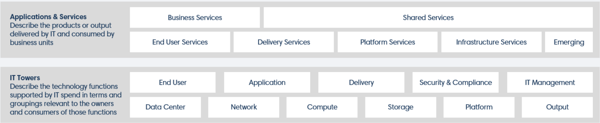

# Лабораторная работа 1. Знакомство с IaaS, PaaS, SaaS сервисами в облаке на примере Amazon Web Services (AWS). Создание сервисной модели

Вариант: 1

Выполнили:  Артемий Преображенский, Артемий Якшин

## Цель работы

Знакомство с облачными сервисами. Понимание уровней абстракции над инфраструктурой в облаке. Формирование понимания типов потребления сервисов в сервисной-модели.

## Дано

1. Слепок данных биллинга от провайдера после небольшой обработки в виде SQL-параметров. Символ % в начале/конце означает, что перед/после него может стоять любой набор символов.
2. Образец итогового соответствия, что желательно получить в конце. В этом же документе  

## Ход выполнения

Итак, в данной лабораторной работе нам необходимо распределить потребление сервисов по иерархии, чтобы можно было провести анализ от большего к меньшему. Для этого мы будем использовать следующие источники.

1. Информацию об IT Tower и общих категориях сервисах можно найти на сайте [apptio.com](https://www.apptio.com/platform/atum/).

2.[aws.amazon.com](https://aws.amazon.com/free/?p=ft&z=subnav&loc=2&refid=98726dec-144b-4b4c-b571-9febd1d05198&all-free-tier.sort-by=item.additionalFields.SortRank&all-free-tier.sort-order=asc&awsf.Free%20Tier%20Types=*all&awsf.Free%20Tier%20Categories=*all) - в разделе Overview мы можем найти фильтры на все интересующие нас категории. Оттуда мы берем Service Family.

3.[AWS Price List API Serivces](https://aws-price-list-api-values.alanwsmith.com/) - здесь можно найти Service Type, Service Sub Type и прочую полезную информацию.

4.[docs.aws.amazon.com](https://docs.aws.amazon.com/?nc2=h_ql_doc_do) - в поиске мы можем найти всю информацию о конкретном разделе. Используем документацию, чтобы найти Service Sub Type и Service Usage Type.

На основе Product Code и Usage Type заполняем всю [таблицу](https://docs.google.com/spreadsheets/d/1GvFC9WZPQ6x2wD0hDskqCn9f3an3M2eHxoqT5yuw4k0/edit?usp=sharing) и сортируем от большего к меньшему.

## Описание сервисов

1. Amazon Translate — это нейронный сервис машинного перевода для перевода текста с английского языка и на английский язык по всему спектру поддерживаемых языков.

2. Amazon Transcribe — это сервис автоматического распознавания речи, который использует модели машинного обучения для преобразования аудио в текст.

3. Amazon Simple Storage Service — это сервис объектного хранения, который предлагает ведущую в отрасли масштабируемость, доступность данных, безопасность и производительность.

4. Amazon Redshift — это быстрый, полностью управляемый сервис хранилища данных петабайтного масштаба, который упрощает и делает экономически выгодным эффективный анализ всех ваших данных с использованием существующих инструментов бизнес-аналитики.

5. Amazon Simple Notification Service — это веб-сервис, который позволяет приложениям, конечным пользователям и устройствам мгновенно отправлять и получать уведомления из облака.

6. AWS CodePipeline — это сервис непрерывной доставки, который позволяет моделировать, визуализировать и автоматизировать шаги, необходимые для выпуска вашего программного обеспечения.

7. AWS CodeBuild — это полностью управляемый сервис сборки, который компилирует ваш исходный код, запускает модульные тесты и создает артефакты, готовые к развертыванию.

8. Amazon Machine Learning — это облачный сервис, который позволяет разработчикам и бизнесам создавать, обучать и внедрять модели машинного обучения в различные сферы бизнеса.

9. Amazon Polly — это облачный сервис, который преобразует текст в реалистичную речь.

10. AWS Directory Service — это управляемый сервис, который позволяет пользователям создавать и управлять каталогами, обеспечивая централизованное управление доступом и аутентификацией для ресурсов AWS и приложений.

## Используемые источники

1. <https://aws.amazon.com/free/?p=ft&z=subnav&loc=2&refid=98726dec-144b-4b4c-b571-9febd1d05198&all-free-tier.sort-by=item.additionalFields.SortRank&all-free-tier.sort-order=asc&awsf.Free%20Tier%20Types=*all&awsf.Free%20Tier%20Categories=*all>
2. <https://aws-price-list-api-values.alanwsmith.com/>
3. <https://docs.aws.amazon.com/?nc2=h_ql_doc_do>
4. <https://www.apptio.com/platform/atum/>
