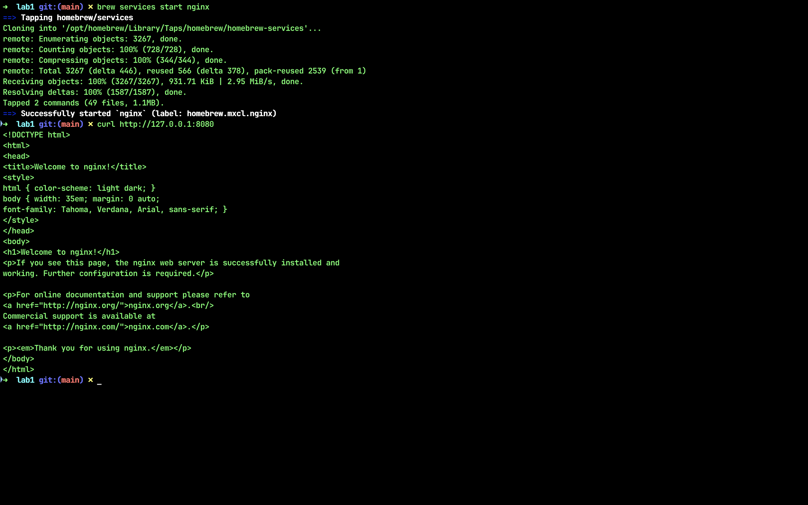
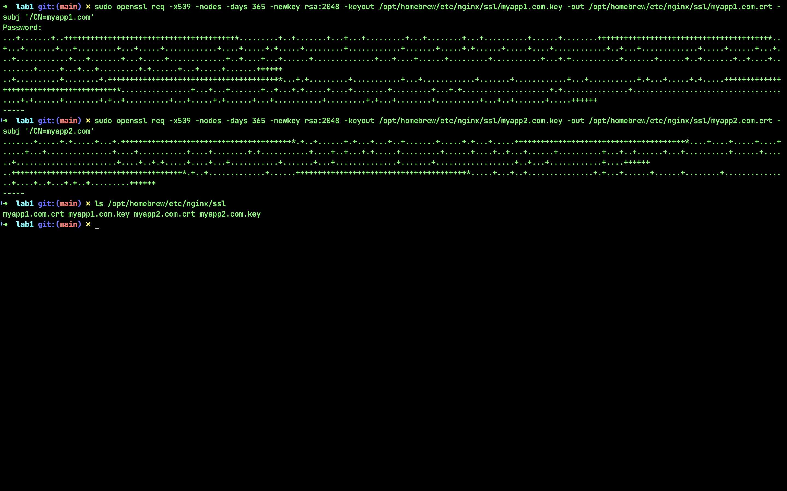
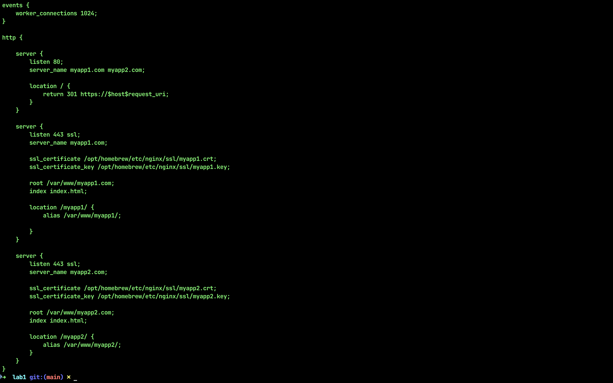
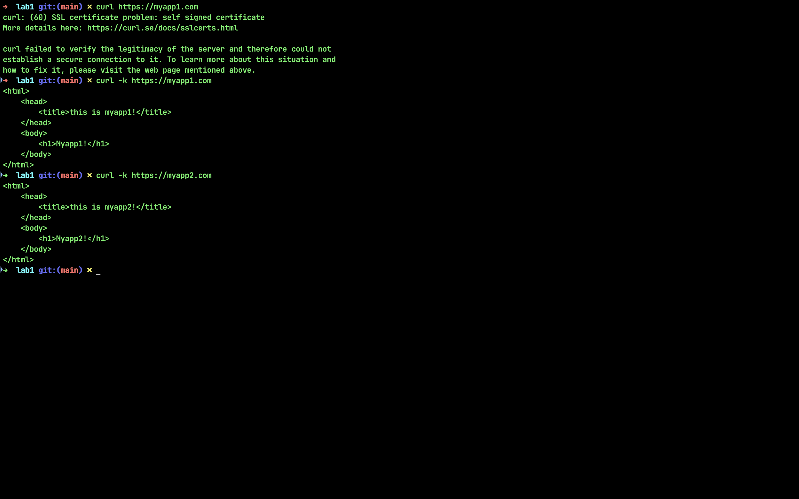
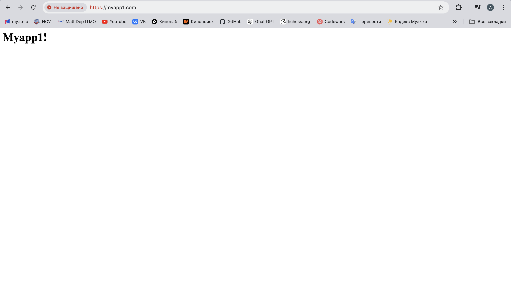

# Лабораторная №1

Итак, приступаем к выполнению курса лабораторных работ по предмету Облачные системы и технологии. Данная работа затрагивает настройку nginx по заданному тз, поэтому не будем терять времени. Для удобства проверки все введенные команды и скрины приложены в отчете.

## Ход выполнения

Первым делом нам нужно установить nginx, поэтому переходим в рабочую директорию и последовательно вводим в терминале команды:

`brew update`
`brew install nginx`

После установки запускаем nginx и сразу же проверяем корректность работы:

Видим, что все гуд, а значит можно переходить к генерации самоподписанного сертификата. Тут нам на помощь приходит chat-gpt. Вводим следующие команды:

`openssl req -x509 -nodes -days 365 -newkey rsa:2048 -keyout /opt/homebrew/etc/nginx/ssl/myapp1.key -out /opt/homebrew/etc/nginx/ssl/myapp1.crt -subj "/C=US/ST=State/L=City/O=Organization/OU=Department/CN=myapp1.com"`

`openssl req -x509 -nodes -days 365 -newkey rsa:2048 -keyout /opt/homebrew/etc/nginx/ssl/myapp2.key -out /opt/homebrew/etc/nginx/ssl/myapp2.crt -subj "/C=US/ST=State/L=City/O=Organization/OU=Department/CN=myapp2.com"`

После заполнения данных можно проверить, появились ли файлы myapp.com.crt и myapp.com.key у нас в директории.

Далее займемся нашими виртуальными хостами. Введем команду,чтобы создать папки для индексных файлов:

`sudo mkdir -p /var/www/myapp1.com /var/www/myapp2.com`

Затем создадим простейшие html-файлы и выведем их:

Готово. Откроем файл конфигурации nginx.conf и вставим туда следующее содержимое (файл приложен в отчете):

Мы настроили alias, перенаправили HTTP-запросы, настроили виртуальные хосты для myapp1.com и myapp2.com. После этого перезапускаем nginx:

`sudo nginx -t`
`sudo nginx -s reload`

Теперь с помощью curl попробуем получить доступ к myapp1.com и myapp2.com. Видим, что сервер не доверяет самоподписанным сертификатам, поэтому выставляем флаг -k, игнорирующий проверку.

Вуаля. Также можно попробовать ввести адрес в браузере.

## Используемые источники

1. <https://dev.to/maxcore/basic-ultimate-guide-nginx-1ngd>
2. <https://nginx.org/ru/docs/beginners_guide.html>
3. <https://jino.ru/spravka/articles/nginx_server_blocks.html#%D1%83%D1%81%D1%82%D0%B0%D0%BD%D0%BE%D0%B2%D0%BA%D0%B0-%D0%B8-%D0%BF%D0%B5%D1%80%D0%B2%D0%B8%D1%87%D0%BD%D0%B0%D1%8F-%D0%BD%D0%B0%D1%81%D1%82%D1%80%D0%BE%D0%B9%D0%BA%D0%B0-nginx>