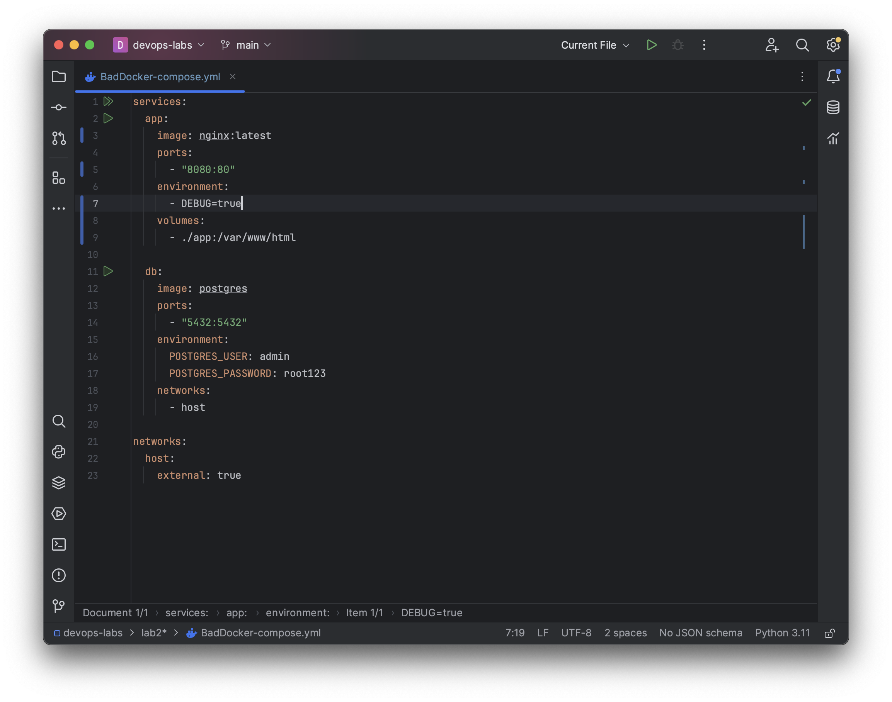
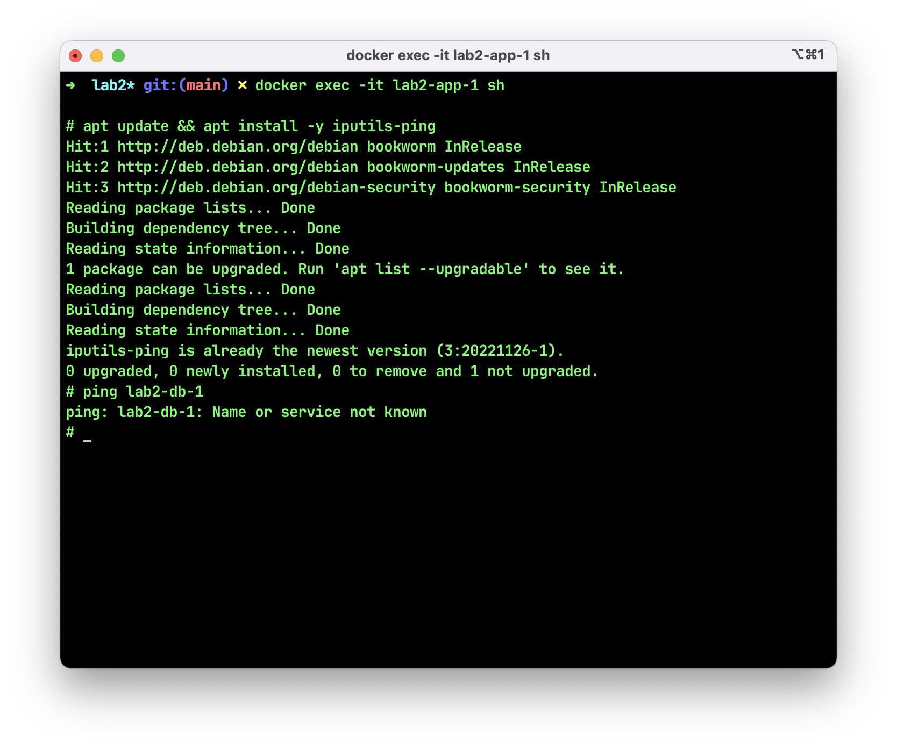

# Лабораторная №2* (со звездочкой)

Устанавливать Docker Compose будем из официального репозитория на GitHub.

`sudo curl -L "https://github.com/docker/compose/releases/download/2.2.3/docker-compose-$(uname -s)-$(uname -m)" -o /usr/local/bin/docker-compose`

После установки сделаем файл исполняемым:

`sudo chmod +x /usr/local/bin/docker-compose`

Готово. Теперь приведем пример плохого и хорошего docker-compose соответственно.

## Плохие практики в docker-compose и способы их исправления

1. Использование сетей хоста. Это означает, что необходимо резервировать определенные порты для различных микросервисов. Проблемы возникают в тот момент, когда вам нужно использовать стеки с одинаковыми портами (кстати, вопрос безопасности еще никто не отменял!).

    * _Правильная практика:_ Разделять микросервисы разными сетями. Например, docker-compose запускает свои контейнеры в отдельной сети с именем имякаталога_default.

2. Привязка портов к 0.0.0.0 хоста. Данная практика не просто перенаправляет порт контейнера на локальный хост - она перенаправляет его, чтобы он был доступен на каждом сетевом интерфейсе в вашей системе. Это значит, что контейнеры разработки постоянно прослушивают вашу локальную сеть (что, естественно, небезопасно).

    * _Правильная практика:_ Добавьте ip-адрес впереди порта - так вы покажите докеру, что нужно открыть порт только для петлевого сетевого интерфейса.

3. Хрупкая конфигурация. Прежде всего сюда относится хранение данных непосредственно в файле. Это плохая практика, которая к тому же не безопасна.

    * _Правильная практика:_ Использование env-файлов поможет сохранить секреты в истории git и упростит возможность настройки для разных разработчиков.

## Изоляция контейнеров
Запустим nginx в фоновом режиме и проверим, "видят" ли контейнеры друг друга по сети. Для этого подключимся к одному из контейнеров, например, lab2-app-1.

`docker-compose up -d`

`docker exec -it lab2-app-1 sh`

Далее введем команды:

`apt update && apt install -y iputils-ping`

`ping <IP-адрес 2 контейнера>`

Видим, что пакеты успешно доходят. Теперь изолируем контейнеры. Для 2 контейнеров в GoodDocker-compose.yml мы используем разные сети: app_net и db_net соответственно. Таким образом, контейнеры поднимаются вместе, но не "видят" друг друга (если контейнеры в Docker запускаются в разных сетях, то они изолируются друг от друга на уровне сетевых пространств). 

После повторения процедуры можно заметить, что теперь мы получаем сообщение об ошибке.

### Результаты исправления

В результате исправлений повысилась безопасность приложения и устойчивость данных. Также конфигурация стала более надежной. 

### Используемые источники

1. <https://blimpup.medium.com/5-common-mistakes-when-writing-docker-compose-b02aee205b3>
