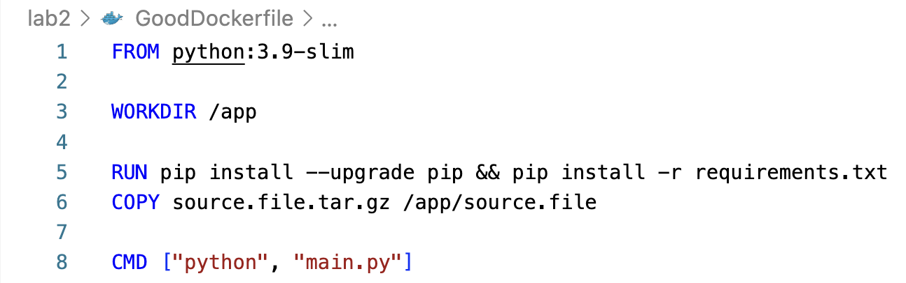
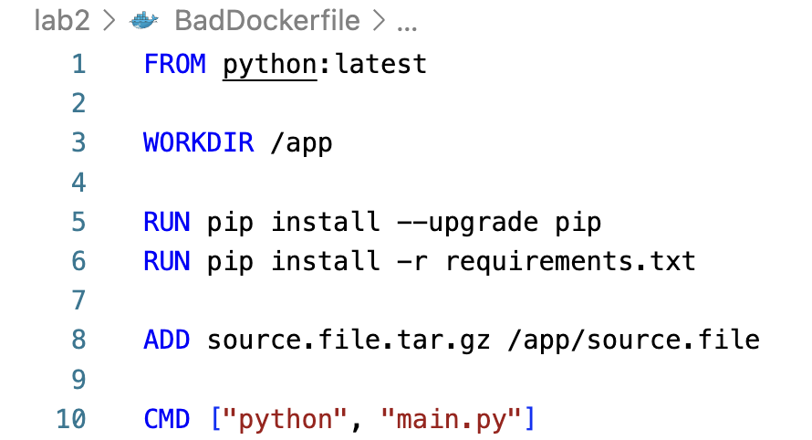
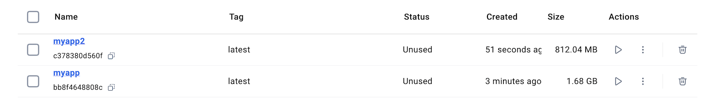

# Лабораторная №2

Продолжаем делать devops-лабы, и на очереди у нас докерфайлы и контейнеры. Без лишних слов переходим к непосредственному решению. Для начала приведем пример хорошего и плохого Dockerfile соответственно.

## Плохие практики в Dockerfile и способы их исправления

1. Используйте ADD вместо COPY (даже во время добавления файлов из URL или из tar-файла, где не нужны доп.функции ADD).  

    * _Правильная практика:_ Используйте COPY - он более предсказуем и менее подвержен ошибкам.  

2. Используйте нескольких команд RUN, если хотите создать дополнительные слои в контейнере и увеличить его размер (а также ухудшить читаемость).

    * _Правильная практика:_ Объедините команды RUN для уменьшения количества слоев.  

3. Используйте latest без необходимости, ведь тогда замедлится время загрузки контейнера и его развертывания.  

    * _Правильная практика:_ Используйте минимальные образы, например, 3.9-slim.

## Плохие практики по работе с контейнерами

1. Запуск процессов от имени root. Самая очевидная ошибка при работе с контейнерами. В реальности требование прав root может расцениваться как угроза безопасности.

    * _Правильная практика:_ Для указания пользователя, отличного от root, от имени которого будет запускаться контейнер, используйте флаг `--user` в команде `docker run` (да, также можно использовать USER в докерфайле, но тогда эта практика сюда бы не подошла).  

2. Создание образов из уже запущенных контейнеров.  

    * _Правильная практика:_ Не стоит запускать docker commit для создания образа, поскольку такие образы не будут воспроизводиться. Очевидным решением будет использовать Dockerfile, в котором можно легко отследить изменения, если хранить его в репозитории исходных текстов.

## Как исправления повлияли на результат?

Результаты оказались действительно впечатляющими: после исправления ошибок вместо 1.68 GB образ стал весить скромные 812 MB.

## Используемые источники

1. <https://habr.com/ru/companies/redhatrussia/articles/421663/>
2. <https://developers.redhat.com/blog/2016/02/24/10-things-to-avoid-in-docker-containers>
3. <https://testdriven.io/blog/docker-best-practices/>
4. <https://sysdig.com/blog/dockerfile-best-practices/>
