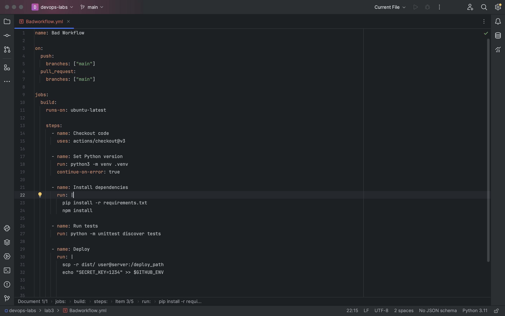
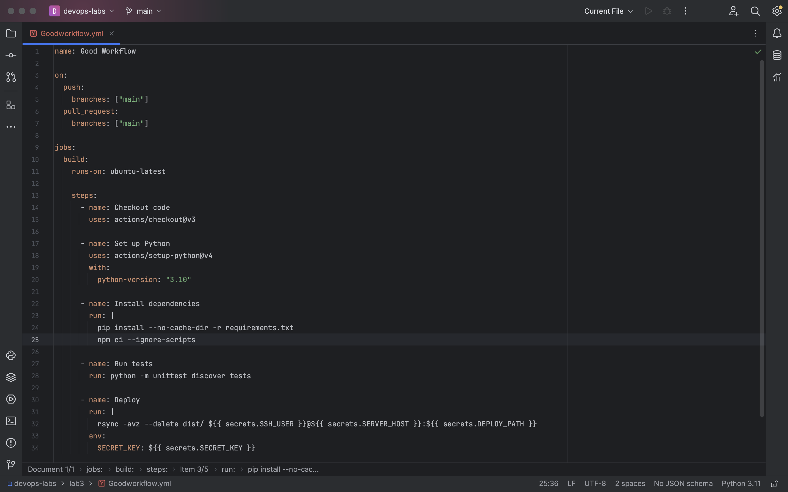

# Лабораторная №2

Завершающая лабораторная затрагивает bad practice в СI/CD файлах (удалось найти не так много полезной информации, поэтому будем использовать плохие практики и способы их исправления с вот этой статьи на [reddit](https://www.reddit.com/r/devsecops/comments/x1ye1o/cicd_bad_practices_best_practices_mistakes/)). Для начала приведем пример плохого и хорошего workflow-файла соответственно.

## Плохие практики в CI/CD файлах и способы их исправления

1. Использование npm install в конвейере CI.  

    * _Правильная практика:_ Используйте `npm ci`, так как это не приведет к расхождению версий между средами (поскольку при install файл package-lock.json перезаписывается).

2. Не использование флага --ignore-scripts при `npm ci`.

    * _Правильная практика:_ Когда вы используете --ignore-scripts, npm пропускает выполнение скриптов, которые обычно запускаются в процессе установки зависимостей. Тем самым вы обезопасите себя от вредоносного кода, который может быть внедрен.

3. Использование флага continue-on-error.  

    * _Правильная практика:_ В данном контексте continue-on-error не нужен, а в реальных сценариях важно следить за тем, чтобы ошибки не игнорировались и процесс был надежным.

4. Установка путей и секретов напрямую.

    * _Правильная практика:_ Использование долгосрочных секретов в конвейерах CI/CD небезопасно, значения нужно брать из GitHub Secrets. Также не нужно напрямую ставить пути, поскольку это уменьшает гибкость.

5. Использование scp.  

    * _Правильная практика:_ Используйте rsync, поскольку он рекурсивно загружает директории, поддерживает докачку в обе стороны, более производителен и безопасен.

## Как исправления повлияли на результат?

В результате исправлений время на установку зависимостей уменьшилось, CI/CD файл стал более гибок и способен легко менять сервер и путь через переменные окружения, не изменяя сам файл. Также увеличилась безопасность, т.к. секреты не сохраняются в репозитории или логах CI/CD.

## Используемые источники

1. <https://habr.com/ru/companies/maxilect/articles/799177/>
2. <https://www.reddit.com/r/devsecops/comments/x1ye1o/cicd_bad_practices_best_practices_mistakes/>
3. <https://dimio.org/rsync-otlichnaya-zamena-scp.html>
